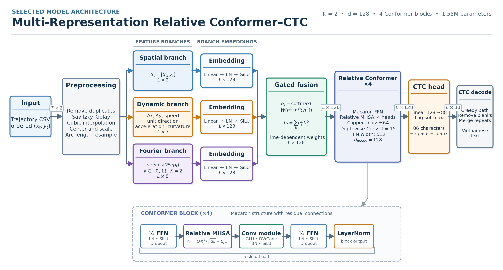

# Vietnamese Air-Writing Recognition

Character-level recognition of Vietnamese air-writing trajectories using
multi-representation gated fusion, a relative-position Conformer encoder, and
Connectionist Temporal Classification (CTC).

The repository contains the training and evaluation pipeline used for the
SOICT paper, preserved model checkpoints, a frozen source-disjoint split, and a
standalone inference interface for coordinate CSV files.



## Results

The paper checkpoint uses two Fourier scales and contains 1.55 million
parameters. On the held-out source-disjoint test set, it produces 207 character
edits over 11,721 reference characters and correctly transcribes 2,157 of 2,276
complete trajectories.

| Configuration | CER (%) ↓ | WER (%) ↓ | Exact accuracy (%) ↑ |
|---|---:|---:|---:|
| BiLSTM–CTC | 73.58 | 97.55 | 3.51 |
| GRU–CTC | 58.58 | 92.55 | 10.63 |
| TCN–CTC, compact diagnostic | 91.02 | 100.00 | 0.00 |
| Transformer–CTC + absolute PE | 11.79 | 22.51 | 85.85 |
| Conformer–CTC + relative PE | 1.85 | **5.46** | **94.90** |
| Gated Fourier, K=2, paper checkpoint | **1.77** | 5.55 | 94.77 |
| Gated Fourier, K=4 | 2.36 | 7.11 | 93.28 |
| Gated Fourier, K=6 | 2.13 | 6.69 | 93.67 |
| Gated Fourier, K=8 | 2.14 | 6.53 | 93.85 |

CER is computed on Unicode NFC-normalized strings and includes spaces. The K=2
model has the lowest CER in the augmented Fourier-scale comparison. The plain
relative-position Conformer is slightly better in WER and exact sequence
accuracy, so the K=2 result should be interpreted as a character-level gain.

## Model

Each input trajectory passes through the following stages:

1. Consecutive duplicate removal, Savitzky–Golay smoothing, cubic interpolation,
   centroid and maximum-radius normalization, and arc-length resampling to 128
   points.
2. Three parallel representations:
   - spatial coordinates with 2 features per point;
   - 7-dimensional dynamics containing displacement, speed, unit direction,
     acceleration, and curvature;
   - 8-dimensional deterministic multi-scale Fourier features with K=2.
3. Independent `Linear → LayerNorm → SiLU` embeddings into 128 dimensions.
4. Time-dependent softmax gating over the three embedded branches.
5. Four Conformer blocks with four attention heads, learned clipped relative
   bias, a feed-forward width of 512, and a depthwise convolution kernel of 15.
6. A linear CTC head with 88 outputs: 86 corpus characters, one explicit space,
   and one CTC blank.

Training augmentation is applied only to the training split. It includes
rotation, independent axis scaling, Gaussian coordinate noise, and monotone
temporal warping.

## Installation

Python 3.10 or newer is required.

```bash
git clone https://github.com/vnminh/Air-handwritting.git
cd Air-handwritting

python3 -m venv .venv
source .venv/bin/activate
python -m pip install --upgrade pip
python -m pip install -e .
```

For an exact match to the training container, install the pinned dependencies:

```bash
python -m pip install -r requirements.txt
python -m pip install -e . --no-deps
```

CUDA is optional for inference. The CLI selects CUDA when it is available and
otherwise runs on CPU.

## Quick inference

The repository includes successful and failure examples from the held-out test
split:

```bash
python -m airwriting examples/bao_gio.csv \
  --checkpoint models/best_fourier_k2.pt --device auto
```

The command returns UTF-8 JSON:

```json
{
  "source": "examples/bao_gio.csv",
  "checkpoint": "models/best_fourier_k2.pt",
  "prediction": "bao giờ",
  "raw_points": 156,
  "model_points": 128,
  "device": "cpu",
  "mean_fusion_weights": {
    "spatial": 0.1805,
    "dynamic": 0.4088,
    "fourier": 0.4107
  }
}
```

The installed console entry point provides the same interface:

```bash
airwriting-infer examples/bao_gio.csv \
  --checkpoint models/best_fourier_k2.pt
```

Multiple trajectories can be processed after loading the model once:

```bash
python -m airwriting \
  examples/bao_gio.csv \
  examples/ngon_nui_cao_voi_voi.csv \
  examples/bi_failure.csv \
  --checkpoint models/best_fourier_k2.pt \
  --jsonl
```

The expected predictions are:

| Example | Reference | Prediction | Outcome |
|---|---|---|---|
| `bao_gio.csv` | `bao giờ` | `bao giờ` | Correct |
| `ngon_nui_cao_voi_voi.csv` | `ngọn núi cao vời vợi` | `ngọn núi cao vời vợi` | Correct |
| `bi_failure.csv` | `bí` | `bú` | Vowel substitution |

An input CSV must contain an `x,y` header and at least two finite coordinate
rows:

```csv
x,y
568.0,486.0
567.0,477.0
```

## Python API

`AirWritingRecognizer` loads the checkpoint once and reconstructs the model,
preprocessing settings, feature branches, and output vocabulary stored in that
checkpoint.

```python
from airwriting.inference import AirWritingRecognizer

recognizer = AirWritingRecognizer(
    "models/best_fourier_k2.pt",
    device="auto",
)

result = recognizer.predict_csv("examples/bao_gio.csv")
print(result["prediction"])

results = recognizer.predict_many(
    ["examples/bao_gio.csv", "examples/bi_failure.csv"]
)
```

NumPy arrays with shape `(T, 2)` can be transcribed with
`recognizer.predict_points(points)`. Set `AIRWRITING_CHECKPOINT` to define the
default checkpoint outside a source checkout.

## Dataset and split protocol

The full VNI Air Writing Dataset is not stored in this repository. Place the
downloaded data at:

```text
Vni_air_writing/
└── VNI_airwriting/
    ├── 1_gram/
    ├── 2_grams/
    ├── 3_grams/
    └── n_grams/
```

Each label directory must end in `_w`, and each sample must be a coordinate CSV
named with its numeric source ID, for example:

```text
VNI_airwriting/2_grams/bao giờ_w/17.csv
```

The raw collection contains 22,760 files. Six byte-identical duplicates are
removed, leaving 22,754 trajectories and 660 labels. The frozen manifest is
[`manifests/split_seed_20260908.json`](manifests/split_seed_20260908.json).

| Split | Trajectories | Numeric source IDs | Label coverage |
|---|---:|---:|---:|
| Train | 18,202 | 40 | 660/660 |
| Validation | 2,276 | 5 | 660/660 |
| Test | 2,276 | 5 | 660/660 |

Numeric source IDs are globally disjoint across the three splits. The dataset
does not provide metadata confirming that these IDs identify individual
writers. Results are therefore described as source-disjoint rather than
writer-independent.

Regenerate the source-disjoint manifest with:

```bash
python scripts/make_manifest.py --protocol source
```

An exploratory lexical-disjoint manifest can be generated with `--protocol
label`; it is retained for audit purposes and is not used for the paper's main
results.

## Training on Modal

Install and authenticate the Modal CLI separately from the model dependencies:

```bash
python -m pip install modal
modal setup
```

Create the dataset archive, upload it to a persistent Modal volume, and build
the exact preprocessing cache:

```bash
tar -C Vni_air_writing -czf /tmp/vni_airwriting.tar.gz VNI_airwriting

modal volume create vni-airwriting-data
modal volume create vni-airwriting-results
modal volume put \
  vni-airwriting-data \
  /tmp/vni_airwriting.tar.gz \
  /staging/vni_airwriting.tar.gz

modal run modal_app.py::prepare_data_volume
modal run modal_app.py::prepare_exact_cache
```

Run a two-epoch smoke test before launching the experiment suites:

```bash
modal run modal_app.py --suite smoke
```

Long suites should be detached so they continue after the local terminal is
closed:

```bash
modal run --detach modal_app.py --suite core
modal run --detach modal_app.py --suite extended
modal run --detach modal_app.py --suite priority
modal run --detach modal_app.py --suite robustness
```

The suites cover:

| Suite | Experiments |
|---|---|
| `smoke` | Two-epoch pipeline check |
| `priority` | Transformer, Conformer, and proposed model |
| `core` | Backbones, representations, fusion, positional encoding, augmentation, and selected multi-seed runs |
| `extended` | Fourier scales, preprocessing components, and input lengths |
| `robustness` | Rotation, noise, scaling, and temporal-warp perturbations |

Download completed experiment directories with:

```bash
modal volume get vni-airwriting-results /experiments ./artifacts
```

Each completed run contains `best.pt`, `result.json`, validation/test prediction
files, training history, environment metadata, and edit-error statistics.
Existing completed runs are detected and skipped when a suite is restarted.

## Checkpoints

The repository preserves several source-disjoint and exploratory checkpoints.
Two checkpoints are particularly relevant:

| Checkpoint | Selection scope | Validation CER (%) | Test CER (%) | SHA-256 |
|---|---|---:|---:|---|
| `best_fourier_k2.pt` | Paper's augmented Fourier-scale comparison | 1.85 | 1.77 | `fe460023f0037dfe58697c3f795cc61dca040b21dda02297e200274e8bc46e4b` |
| `best_validation_selected.pt` | Best validation CER among completed seed-42 source-disjoint runs | 1.51 | 1.57 | `08b1ebc27d122af8701a0ae7f354b4ecf387e2db0714a273e025f5db730662a9` |

The inference examples and paper analysis use `best_fourier_k2.pt`. See
[`models/README.md`](models/README.md) for the complete checkpoint inventory and
the exploratory label-disjoint results.

## Repository structure

```text
airwriting/                 Reusable data, model, metric, training, and inference modules
examples/                   Held-out CSV trajectories for end-to-end inference
manifests/                  Frozen split definitions and duplicate hashes
models/                     Preserved PyTorch checkpoints
paper/                      LaTeX manuscript and publication figures
scripts/                    Manifest, inference, cache, table, and figure utilities
tests/                      Core preprocessing, model, decoding, and manifest tests
modal_app.py                Modal data preparation, training, robustness, and inference app
pyproject.toml              Installable package and console entry point
requirements.txt            Exact training dependency versions
```

## Validation

Run the core test suite locally with:

```bash
python -m pip install pytest
python -m pytest -q
```

The architecture figure used by the paper can be regenerated as a LaTeX-ready
vector PDF and high-resolution PNG:

```bash
python -m pip install matplotlib
python scripts/render_architecture.py
```

## Citation

If this repository supports your work, cite the accompanying paper and the VNI
Air Writing Dataset. The final BibTeX entry should be updated after the paper's
publication metadata becomes available.

```bibtex
@inproceedings{vietnamese_airwriting_conformer,
  title  = {Multi-Representation Trajectory Learning for Vietnamese
            Air-Writing Recognition},
  author = {Anonymous Authors},
  year   = {2026}
}
```

## Limitations

The model starts from tracked 2D coordinates and does not include fingertip
detection from images or video. Its performance therefore excludes errors from
lighting, viewpoint, occlusion, and upstream hand tracking. Writer-independent
generalization cannot be claimed without verified writer identifiers. Errors
are concentrated in long trajectories and short discriminative vowel or
diacritic movements; the included `bí → bú` example illustrates this failure
mode.
